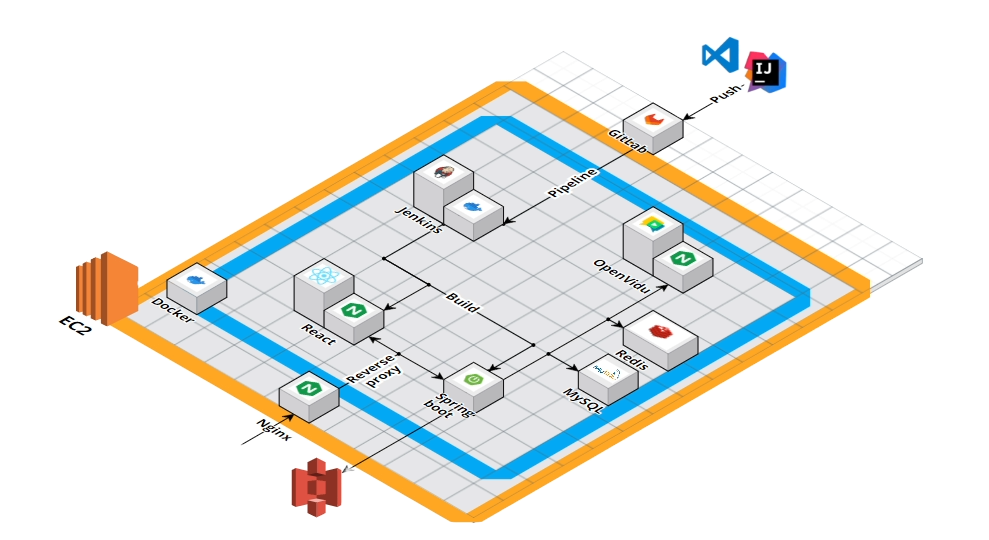
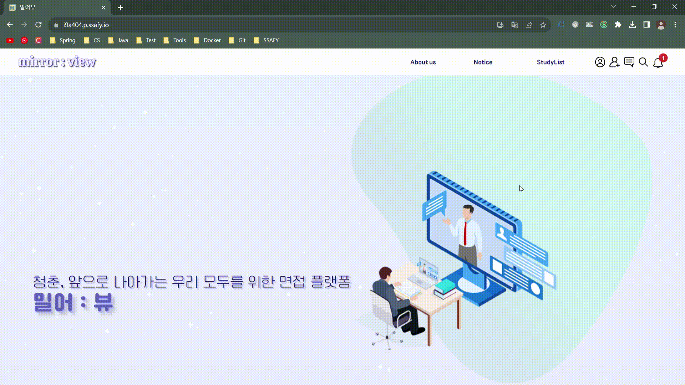

## 목차
1. [**서비스 소개**](#1)
2. [**프로젝트 일정**](#2)
3. [**팀원 소개**](#3)
4. [**기술 스택**](#4)
5. [**시스템 아키텍처**](#5)
6. [**주요 기능**](#6)

## 💡 서비스 소개

### 면접 스터디 최선의 선택, Mirror-View

> 몇번의 Click만으로 진행되는 온라인 면스 !  
> 시간 제약 없이 가능한 온라인 면스 ! 
> 나만의 피드백 아카이브로 성장 가능성 Up !

 

## 📆 프로젝트 기간

### 23.07.10 ~ 23.08.18

- 기획 및 설계 : 23.07.10 ~ 23
- 프로젝트 구현 : 23.07.23 ~ 08.13
- 버그 수정 및 산출물 정리 : 23.08.14 ~ 28

 

## 👪 팀원 소개

<table>
    <tr>
        <td height="140px" align="center"> <a href="https://github.com/yoon-yoo-tak">
                👑 윤유탁  (Back-End) </a>  </td>
        <td height="140px" align="center"> <a href="https://github.com/sangilji">
                🙂 지상일  (Back-End) </a>  </td>
        <td height="140px" align="center"> <a href="https://github.com/eastsage">
                😆 이동현  (Back-End) </a>  </td>
        <td height="140px" align="center"> <a href="https://github.com/chakunyoung">
                😁 차건영  (Back-End) </a>  </td>
        <td height="140px" align="center"> <a href="https://github.com/hyeii">
                🙄 윤혜민  (Front-End) </a>  </td>
        <td height="140px" align="center"> <a href="https://github.com/JungWonsik">
                😶 정원식  (Front-End) </a>  </td>
    </tr>
</table>

 

## 🛠️ 기술 스택

| JavaScript |            Redux            |  React   |  Node   |           Spring Boot            |           Spring  Security           |         Jenkins         | Docker  |                 Redis                 |     Spring  Data Jpa      |           NginX            |            MySQL            |             EC2             |                 Web RTC                  |
| :--------: |:---------------------------:| :------: | :-----: |:--------------------------------:|:------------------------------------:|:-----------------------:|:-------:|:-------------------------------------:|:-------------------------:|:--------------------------:|:---------------------------:|:---------------------------:|:----------------------------------------:|
|    |  ||||||||||||  |

 

## 🗂️ 시스템 아키텍처

 

## 💻 주요 기능

### 메인 & About Us
- 밀어뷰가 어떤 목적으로 제작되었는지 이야기합니다.

### 회원 기능
- 회원 가입, 로그인 등

### 친구 기능
- 사용자끼리 정보 및 친구 기능

### 공지 게시판
- admin 계정만 작성할 수 있는 공지 보드 기능

### 자기 소개서
- 면접 스터디에 사용할 자기소개서를 작성하고 관리하는 기능

### 채팅 기능
- 오픈채팅 & 개인채팅 & 알림 & 친구 등

### 면접방 리스트
- 면접방 생성 & 조회 기능

### 면접 준비방
- 면접 스터디를 시작하기 전 사전 준비 기능

### 면접 진행
- 실제 면접을 진행하는 기능

### 🚀 [공유 문서 Notion Link](https://elated-tortoise-2aa.notion.site/7487d4f8729d48aa9fffc8e1114378ab?v=58376fb817294207bbf22ad896f56f34&pvs=4)
**마지막으로 팀 공유문서 입니다!**

 
